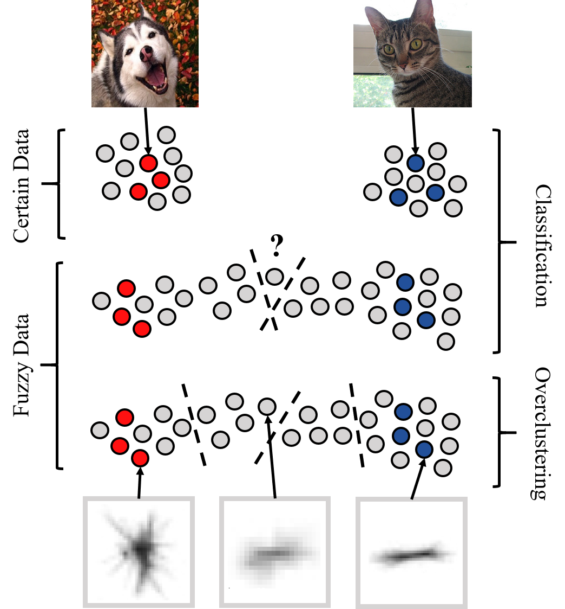

# Fuzzy Overclustering (FOC)

In real-world datasets, we need consistent annotations between annotators to give a certain ground-truth label.
However, in many applications these consistent annotations can not be given due to issues like intra- and interobserver variability.
We call these inconsistent label fuzzy.
Our method Fuzzy Overclustering overclusters the data and can therefore handle these fuzzy labels better than Out-of-the-Box Semi-Supervised Methods.

More details are given in the accpeted full paper at https://doi.org/10.3390/s21196661 or in the preprint https://arxiv.org/abs/2012.01768

The main idea is illustrated below. The graphic and caption are taken from the original work.

_Illustration of fuzzy data and overclustering -- 
The grey dots represent unlabeled data and the colored dots labeled data from different classes.
The dashed lines represent decision boundaries.
For certain data, a clear separation of the different classes with one decision boundary is possible and both classes contain the same amount of data (top).
For fuzzy data determining a decision boundary is difficult because of intermediate datapoints between the classes (middle).
These fuzzy datapoints  can often not be easily sorted into one consistent class between annotators.
If you overcluster the data, you get smaller but more consistent substructures in the fuzzy data (bottom).
The images illustrate possible examples for \certain data (cat \& dog) and \fuzzy plankton data (trichodesmium puff and tuft).
The center plankton image was considered to be trichodesmium puff or tuft by around half of the annotators each.
The left and right plankton image were consistently annotated as their respective class._

## Installation

We advise to use docker for the experiments.
We recommend a python3 container with tesnorflow 1.14 preinstalled. 
Additionally the following commands need to be executed:

    apt-get update
    apt-get install -y libsm6 libxext6 libxrender-dev libgl1-mesa-glx

After this ensure that the requirements from `requirements.txt` are installed. 
The most important packages are keras, scipy and opencv.
 
## Usage

The parameters are given in `arguments.yaml` with their description.
Most of the parameters can be left at the default value. 
Especially the dataset, batch size and epoch related parameters are imported.

As a rule of thumb the following should be applied:
 - overcluster_k = 5-6 * the number of classes
 - batch_size = repetition * overcluster_k * 2-3
 
You need to define three directories for the execution with docker:
- `DATASET_ROOT`, this folder contains a folder with the `dataset` name. This folder contains a `train`and `val` folder. It needs a folder `unlabeled` if the parameter `unlabeled_data` is used. Each folder contains subfolder with the given classes.
- `LOG_ROOT`, inside a subdiretory `logs` all experimental results will be stored with regard to the given `IDs` and a time stamp
- `SRC_ROOT` root of the this project source code

The `DOCKER_IMAGE` is the above defined image.

You can visualize the results with `tensorboard --logdir .` from inside the `log_dir`

## Example Usages

    % test container
    docker run -it --rm -v <DATASET_ROOT>:/data-ssd -v <LOG_ROOT>:/data1   -v <SRC_ROOT>:/src -w="/src" <DOCKER_IMAGE> bash

    % test pipeline running
    docker run -it --rm -v <DATASET_ROOT>:/data-ssd -v <LOG_ROOT>:/data1   -v <SRC_ROOT>:/src -w="/src" <DOCKER_IMAGE> python main.py --IDs foc experiment_name not_use_mi --dataset stl10@s1-u0.10 --unlabeled_data stl10@s1-u0.10  --frozen_batch_size 130 --batch_size 130 --overcluster_k 60 --num_gpus 1 --normal_epoch 2 --frozen_epoch 1

    % training FOC-Light
    docker run -it --rm -v <DATASET_ROOT>:/data-ssd -v <LOG_ROOT>:/data1   -v <SRC_ROOT>:/home -w="/home" <DOCKER_IMAGE> python main.py --experiment_identifiers foc experiment_name not_use_mi --dataset stl10  --frozen_batch_size 130 --batch_size 130 --overcluster_k 60 --num_gpus 1
    
    % training FOC (no warmup)
    % needs multiple GPUs or very large ones (change num gpu to 1 in this case)
    docker run -it --rm -v <DATASET_ROOT>:/data-ssd -v <LOG_ROOT>:/data1   -v <SRC_ROOT>:/home -w="/home" <DOCKER_IMAGE> python main.py --experiment_identifiers foc experiment_name not_use_mi --dataset stl10  --frozen_batch_size 390 --batch_size 390 --overcluster_k 60 --num_gpus 3 --lambda_m 1 --sample_repetition 3
    

